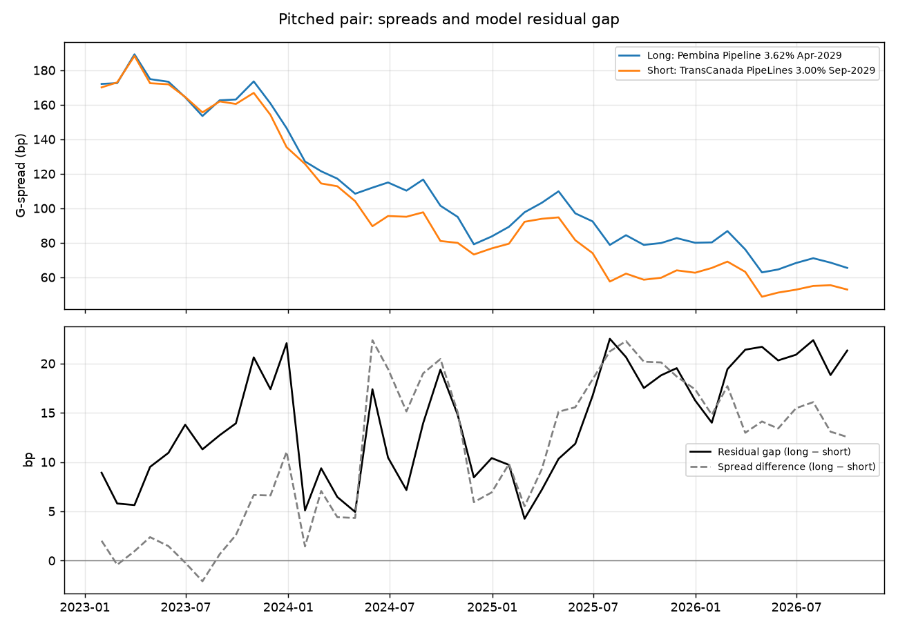

# Long Pembina 3.62% 2029 / Short TCPL 3.00% 2029

**CS01-neutral pipeline relative value · as of September 30, 2026 · Esther Wong**

## Trade summary

Buy Pembina Pipeline 3.62% April 2029 and sell TransCanada PipeLines 3.00% September 2029, sized so both legs carry the same spread risk. The bet is that the 21bp gap between where these bonds trade and where their fundamentals say they should trade narrows. It is not a view on the direction of credit spreads overall.

| | Long (cheap) | Short (rich) |
| --- | --- | --- |
| Bond | Pembina Pipeline 3.62% Apr-2029 | TransCanada PipeLines 3.00% Sep-2029 |
| ISIN | CA70632ZAM38 | CA89353ZCE66 |
| Issued / amount outstanding | 2019 / C$1.0bn | 2019 / C$1.25bn |
| BVAL bid / ask (score) | 98.88 / 98.98 (8) | 97.24 / 97.32 (9) |
| Mid yield (YAS) | 4.07% | 3.99% |
| G-spread / I-spread / Z-spread | 64 / 58 / 61bp | 52 / 46 / 49bp |
| Model residual (z-score) | +14bp (+1.8) | −8bp (−1.0) |
| Ratings (S&P / Moody's / DBRS) (CRPR) | BBB / NR / BBB (high) | BBB+ / Baa2 / BBB (high) |
| Net debt / EBITDA (FY2025) (FA) | 3.1x | 4.4x |
| Face | C$10.0mm | C$8.61mm |
| CS01 | C$2,346 per bp | C$2,346 per bp |

*Prices: BVAL mid, 30-Sep-2026 close. Spreads from YAS against the interpolated GoC curve (G), CAD CORRA swaps (I) and the zero curve (Z).*

## Why the gap exists, and why it should close

- **Like-for-like bonds.** Same sector, same 2019 vintage, prices within 2 points, maturities 5 months apart, both plain bullets (DES). Coupon, vintage, liquidity and call effects, which drive most apparent mispricings in CAD IG, are largely neutralized.
- **Fundamentals favour the long.** Pembina carries about 3.1x leverage against TCPL's 4.4x with a similar rating, yet trades 12bp wider on BVAL. After controlling for maturity, rating, size, price premium, age and structure, the model puts the gap at 21bp.
- **The signal has worked historically.** Across 233 CAD IG bonds from 2023 to 2026, the cheapest fifth of bonds by this model beat the richest by ~3bp per quarter in every year (t ≈ −6). Mispricings close with a half-life of roughly 8–12 months, which sets the holding period.
- **Why it opened:** TCPL outperformed through 2025 as TC Energy cut leverage after the South Bow spin-off. That improvement is already in the price; Pembina's lower leverage is not.
- **Bloomberg agrees with the evaluated data.** The BVAL gap (12bp) is within 1bp of the ETF-holdings gap (13bp), and the 3-year HS history shows the same widening through 2025.

## Levels and economics (12-month horizon)

| | |
| --- | --- |
| Entry (long − short G-spread, BVAL mid) | **12bp** |
| Target | **~1bp** (expected convergence) |
| Stop | **42bp** (30bp wider: 2× the pair's monthly volatility over 12 months) |

| Component | bp | C$ |
| --- | --- | --- |
| Expected convergence: 21bp × (1 − 0.94¹²) | +11.2 | +26,300 |
| Carry (net of funding at the 2-year GoC yield) | +7.9 | +18,500 |
| Roll-down along each issuer curve (GC) | −5.2 | −12,200 |
| Bid/ask (BVAL: 10c long ≈ 4.0bp, 8c short ≈ 3.3bp; full spread round trip) | −7.3 | −17,100 |
| Borrow on TCPL leg (repo special ~15bp/yr on C$8.4mm market value) | −5.4 | −12,600 |
| **Expected** | **+1.2** | **≈ +2,900** |

Positive carry pays to wait: the trade earns about 0.7bp a month while the gap closes slowly. But real costs from the terminal (full BVAL bid/ask and the repo special on the short) take the 12-month expectation from +9.9bp in the model to about **+1.2bp: roughly breakeven**.

**What this means for entry.** At today's 21bp residual gap the trade is a hold, not a buy. With the same costs, a gap of about **29bp** would be needed for +5bp over 12 months (convergence of 0.52 × gap must cover ~10bp of net costs plus the target). Set an alert on the residual gap and enter on a widening, or put it on only if the borrow cost falls.

## Risks

- **The market may be right about TCPL.** The gap has held around 20bp for a year. If TC Energy keeps deleveraging or gets upgraded, the short leg can tighten further. *Mitigant:* stop at 42bp; carry is positive; enter only at a wider gap.
- **Liquidity and index effects.** Pembina is the smaller issuer and is not rated by Moody's, which can keep it structurally wider. *Mitigant:* C$10mm is 1% of the issue; ALLQ shows 4 dealers making two-way markets in each bond.
- **Prices are tradeable.** CIRO trade prints for September 2026 (TDH): 14 trades in Pembina 3.62% 2029 at 98.79–99.05, 22 in TCPL 3.00% 2029 at 97.18–97.40. Volume-weighted, the implied G-spread gap is 12–14bp, consistent with BVAL and the model inputs.
- **Event risk.** New issuance from Pembina, M&A, or regulatory news would widen the long leg. News check (BN, NI NEWISS) as of 30-Sep-2026: no new CAD supply from either issuer in Q3; no rating actions or outlook changes in the past 90 days. Pembina's next earnings is early November, a known event inside the holding period.
- **Short leg is borrowable.** TCPL 3.00% 2029 is available in repo at roughly 15bp under general collateral; included in the P&L above.

## Chart

*Data: Bloomberg (BVAL, YAS, CRPR, FA, ALLQ, BN), CIRO bond trade data, iShares XCB month-end holdings for the model history, Bank of Canada benchmark yields, SEC EDGAR filings and Annual Information Forms. Model and backtest: `reports/writeup.md`.*
