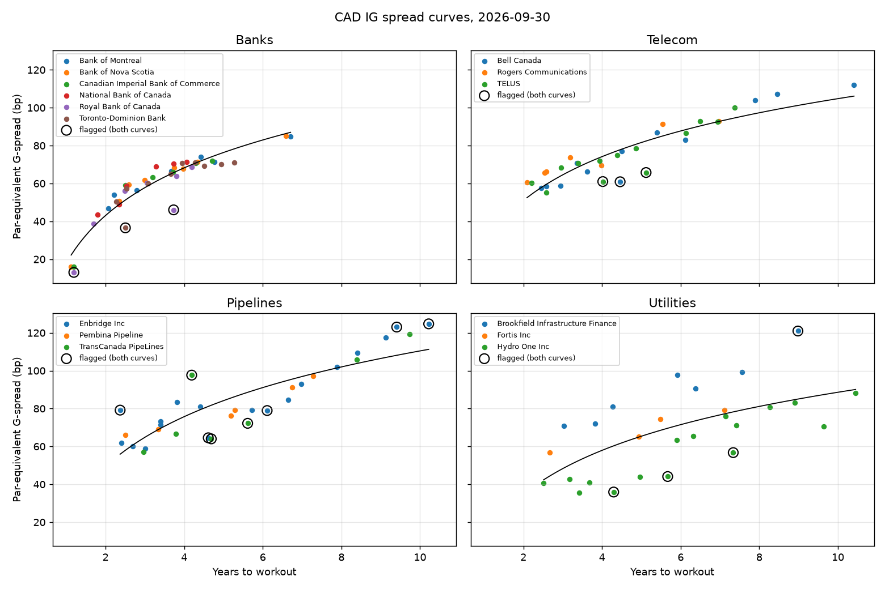
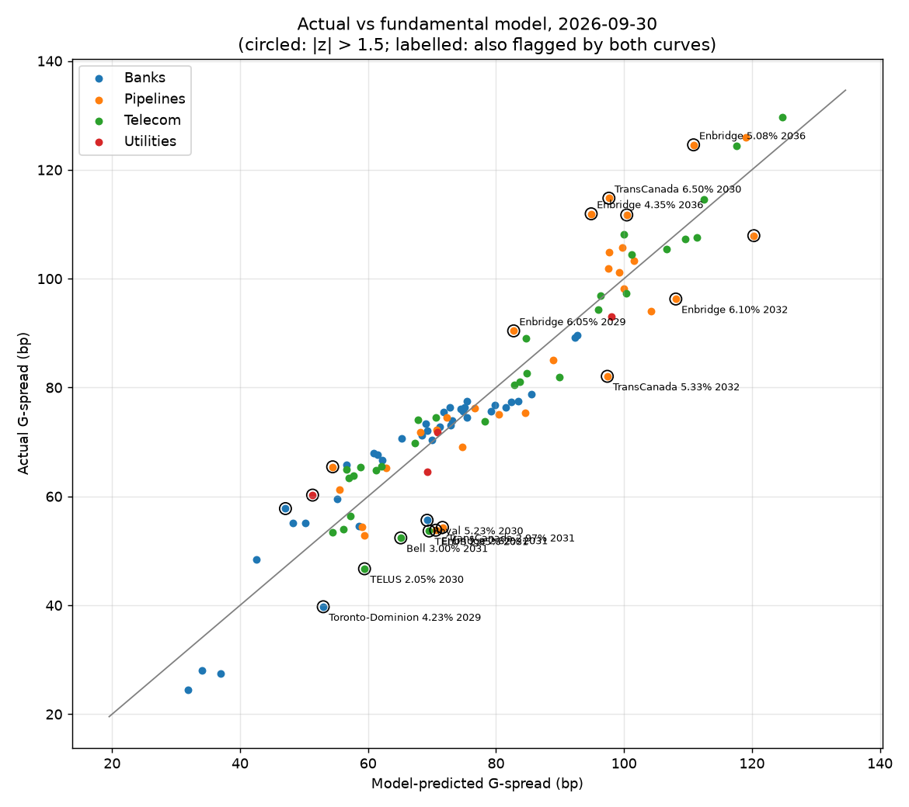
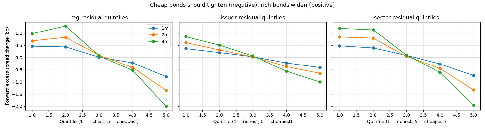

# Canadian Credit Relative Value

**Finding cheap and rich Canadian investment-grade corporate bonds, and whether the gaps close**

Esther Wong · October 2026 · Code and data: this repository (`notebooks/analysis.ipynb` reproduces every number)

---

## Summary

Bonds from issuers of similar credit quality often trade at different spreads. This project measures those gaps across the Canadian investment-grade corporate market, tests whether they close, and turns the strongest one into a trade.

- **Universe:** 233 CAD senior unsecured bonds from 15 issuers in banks, telecom, pipelines and utilities; 45 month-ends from January 2023 to September 2026 (5,873 bond-months).
- **Model built without Bloomberg:** prices and terms come from iShares XCB month-end holdings, the government curve from the Bank of Canada, fundamentals from SEC EDGAR filings, and credit ratings from issuers' Annual Information Forms. The pitched trade was then checked against Bloomberg BVAL and CIRO trade prints.
- **Model:** issuer and sector spread curves plus a fundamental regression (rating, maturity, size, structure controls). Monthly R² 0.87–0.96, mostly because rating and sector sort issuers; leverage and coverage add nothing once those are in.
- **Structural effects matter more than expected.** Within the same issuer, premium bonds trade up to ~2.5bp wider per price point, older bonds wider, and bank notes callable a year early ~20bp wider. Left uncorrected, "cheap" simply meant "high coupon".
- **The signal is real but slow.** The cheapest fifth of bonds beat the richest by ~3bp per quarter, in every year tested (Fama-MacBeth t ≈ −6). The half-life of a mispricing is about 8–12 months.
- **Trade:** long Pembina 3.62% Apr-2029 / short TransCanada PipeLines 3.00% Sep-2029, CS01-neutral. 21bp model gap; Pembina is less levered (3.1x vs 4.4x) with a similar rating yet trades 13bp wider. The model expects +9.9bp over 12 months; with real Bloomberg bid/ask and repo borrow it's about +1.2bp, roughly breakeven, so the pitch is a hold with a ~29bp entry threshold.

---

## 1. Data without a terminal

The original plan assumed Bloomberg. Without one, each field came from a free source behind a common data format, so a Bloomberg feed could replace any of them later without touching the model.

| Need | Source | Notes |
| --- | --- | --- |
| Bond list, prices, coupon, maturity | iShares XCB holdings (BlackRock Canada), month-end files back to 2019 | ~1,350 holdings; ISINs joined from a second file on market value (100% match) |
| Government of Canada curve | Bank of Canada Valet API | 2, 3, 5, 7, 10-year and long benchmarks |
| Leverage, coverage | SEC EDGAR XBRL (40-F, 10-K, 20-F) | Per-issuer tag map; first-filed values and filing dates, so no look-ahead |
| Credit ratings | Annual Information Forms attached to EDGAR filings | 98 dated S&P / Moody's / DBRS rows, each verified against a verbatim quote |

**Universe filters:** CAD, senior unsecured, fixed coupon, 2–12 years to workout, in four sectors. Getting this right turned up three things a Bloomberg screen would have labelled for free:

1. **Bank subordinated debt** sits in the ETF under the bank's plain name. CAD bank bonds with ~10-year terms are NVCC sub debt (10NC5) and were excluded.
2. **Callable bank senior is now the norm.** Since 2023 the big banks issue bail-in senior as 4NC3, 5NC4 and 6NC5 notes, callable a year before maturity (when they stop counting toward TLAC). These are priced to the call date, as the market quotes them.
3. **Floating-rate notes** appear with their current coupon. Both structures were detected by comparing the ETF's reported duration with the duration implied by a plain bullet; after the fixes, every bond's computed duration matches the ETF's (median gap 0.03 years).

**Measuring spreads.** Yields are computed from clean prices (semi-annual, Actual/365 accrual) to each bond's workout date. G-spread = bond yield − Government of Canada yield interpolated to the same maturity, the way the Canadian market quotes corporates.

| Median G-spread (bp) | Banks | Pipelines | Telecom | Utilities |
| --- | --- | --- | --- | --- |
| 2023 | 112 | 172 | 164 | 132 |
| 2024 | 70 | 125 | 120 | 102 |
| 2025 | 69 | 110 | 105 | 87 |
| 2026 | 68 | 94 | 84 | 74 |

The whole sample is one long tightening run, which matters for the backtest.

---

## 2. Structural effects: coupon, age and calls

The first version of the issuer curves flagged every 6–8% coupon bond as cheap and every 2–3% coupon bond as rich. Price premium alone explained 39% of the curve residuals.

Bonds of the same issuer share credit risk, so any systematic spread difference between them is structural. Each month, residuals from the issuer curves were regressed on three bond characteristics:

| Within-issuer effect | 2023 | 2024 | 2025 | 2026 | Likely cause |
| --- | --- | --- | --- | --- | --- |
| bp per point of price above par | 1.0 | 1.4 | 1.9 | 2.5 | Canadian tax treatment favours discount bonds (pull-to-par is a capital gain) |
| bp per ln(1 + years since issue) | 9.1 | 9.0 | 6.0 | 1.6 | Older bonds are less liquid |
| bp for a 1-year-early call | — | 30 | 20 | 14 | Call and extension risk on bank bail-in notes (none in the sample until 2024) |

Every spread is then converted to a **par-equivalent spread**: what a par-priced, newly issued bullet of the same issuer would trade at. After the adjustment, residuals have essentially zero correlation with price premium.

One pattern survives all controls: low-coupon bonds issued in 2020–21 (e.g. TCPL 2.97% 2031, Enbridge 2.82% 2031, TELUS 2.85% 2031, all priced around 94) still look rich as a group. Rather than chase it with more variables, the trade step only pairs bonds of similar price and vintage.

---

## 3. Spread curves

Each month, par-equivalent spread = a + b·ln(years to workout) is fitted per issuer (4+ bonds) and per sector. Each bond is judged against the curve fitted on its **other** bonds (leave-one-out, computed exactly as e/(1−h)), because with 4–10 bonds per issuer an in-sample fit pulls toward the bond itself. Residuals become robust z-scores (scaled by the month's median absolute deviation), and a bond is flagged when it is beyond ±1.5σ on both its issuer and sector curve: about 14 bonds per month.



Sector curves ignore credit quality, so a weaker issuer looks cheap versus its sector (Brookfield Infrastructure versus Hydro One in utilities). The regression handles that.

---

## 4. Fundamental regression

G-spread is regressed on ln(years to workout), average agency rating (AAA = 1 … BBB− = 10), leverage and coverage (non-banks), ln(size), price premium, ln(age), a callable flag, sector dummies and a bail-in dummy. Banks have no leverage or coverage; those enter as zero for banks and the bank dummy absorbs the level.

Two versions are fitted: a **monthly cross-section**, which produces the point-in-time signal used in the backtest, and a **pooled panel** with month fixed effects and standard errors clustered by issuer, which gives the coefficient table.

| Variable (pooled panel, n = 4,708) | Coefficient | Clustered SE | p | Same sign, monthly |
| --- | --- | --- | --- | --- |
| ln(years to workout) | 52.5 | 2.6 | <0.001 | 100% |
| Rating (per notch worse) | 5.8 | 1.6 | <0.001 | 96% |
| Net debt / EBITDA | 1.6 | 1.6 | 0.33 | 53% |
| EBITDA / interest | −0.2 | 0.9 | 0.86 | 53% |
| ln(size) | −4.0 | 2.1 | 0.05 | 96% |
| Price premium (per point) | 1.5 | 0.2 | <0.001 | 100% |
| ln(1 + age) | 7.3 | 2.2 | 0.001 | 87% |
| Callable a year early | 20.5 | 4.1 | <0.001 | 100% |
| Bail-in vs legacy senior | 30.9 | 3.5 | <0.001 | — |
| Pipelines vs utilities | 20.1 | 3.1 | <0.001 | — |
| Telecom vs utilities | 14.3 | 4.6 | 0.002 | — |

**Fit:** monthly R² ranges from 0.87 to 0.96 (median 0.91), well above the 0.5 benchmark. That number should not be oversold: with 12 issuers in the sample, rating and sector nearly pin down each issuer's average spread, so most of the R² is issuer-level sorting.

**Leverage and coverage are not significant** and flip sign in about half the months. With only seven non-bank issuers, they can't be separated from rating and sector. This is a real limitation of the Canadian market's issuer concentration, not of the data source.



A bond is a final **cheap** or **rich** signal only when the regression and both curve fits agree beyond ±1.5σ: about 9 bonds per month.

---

## 5. Do the gaps close?

Every month, using only information available that month, the model's residual is compared with the bond's **excess** spread change over the next 1–3 months: its own change minus the sector average, net of roll-down along the curve.

**Predictive slope (Fama-MacBeth, Newey-West t-statistics).** A slope of −1 would mean the gap fully closes within the horizon.

| Residual | 1 month | 2 months | 3 months |
| --- | --- | --- | --- |
| Regression | −0.045 (t −6.4) | −0.075 (t −6.0) | −0.102 (t −5.3) |
| Issuer curve | −0.026 (t −3.5) | −0.042 (t −2.9) | −0.058 (t −2.7) |
| Sector curve | −0.027 (t −4.0) | −0.046 (t −3.7) | −0.065 (t −3.6) |

The regression slope is negative in 77–88% of months.

**Quintile sorts.** Each month bonds are ranked by regression z-score. Over the next three months the cheapest quintile tightened 2.0bp relative to its sector and the richest widened 1.0bp. The ordering is monotonic across quintiles, and cheapest-minus-richest was negative in every year: −1.2bp (2023), −4.2bp (2024), −2.5bp (2025), −4.8bp (2026).



**Flagged bonds** (regression and both curves agree): cheap bonds tightened 2.0bp and rich bonds widened 2.5bp versus peers over three months, right 59–67% of the time.

**Half-life.** Per-bond AR(1) fits suggest about 3 months, but with ~32 monthly observations per bond the AR coefficient is biased downward by roughly (1+3ρ)/T. Three better estimates agree:

| Method | Half-life |
| --- | --- |
| Per-bond AR(1), bias-corrected | 7.8 months |
| Pooled AR(1) | 8.8 months |
| Share of residual left after 3 months (0.84 → monthly ρ 0.94) | 11.7 months |

Most of the closing is the bond's own spread moving (−0.13 of the −0.16 residual change over three months), not the model's fair value shifting.

**Reading it honestly:** the effect is statistically robust and stable across years, but economically modest. A few basis points per quarter is roughly one bid/ask, so a trade needs a large gap, a holding period of months, and positive carry to pay.

---

## 6. The trade

**Candidate pairs** are bonds in the same sector and call structure, with workouts within 1.5 years, prices within 8 points and issue vintages within 5 years, each with a regression |z| ≥ 0.75 whose sign has held for three months. These filters keep the coupon, vintage and call effects out of the pair. The highest-scoring pairs were banks, but the data can't distinguish covered bonds, deposit notes and bail-in senior (several bank legs carry unusual ISIN prefixes), so the pitch uses the cleanest non-bank pair. One non-bank pair scores higher over 12 months (long Rogers 3.75% 2029 / short TELUS 2.05% 2030, +24bp), but its short leg is a 2020 low-coupon bond priced at 93 — the vintage effect the model can't explain — and Rogers sits at BBB−, one notch above high yield.

| | Long (cheap) | Short (rich) |
| --- | --- | --- |
| Bond | Pembina Pipeline 3.62% Apr-2029 | TransCanada PipeLines 3.00% Sep-2029 |
| Issued | 2019 | 2019 |
| Price / G-spread | 98.92 / 65bp | 97.24 / 53bp |
| Model residual (z) | +14bp (+1.8) | −8bp (−1.0) |
| Net debt / EBITDA | 3.1x | 4.4x |
| Ratings | BBB / BBB (high) | BBB+ / Baa2 / BBB (high) |
| Face (CS01-neutral) | C$10.0mm | C$8.61mm |

**Why the gap should close.** The two bonds are as alike as the market allows: same sector, same vintage, prices 2 points apart, maturities 5 months apart. Pembina carries much less leverage than TCPL with a similar rating, yet trades 13bp wider; the model puts the gap at 21bp after controlling for maturity, rating, size, coupon, age and structure.

**Sizing and model economics.** Legs are sized so each has the same CS01 (C$2,346 per bp), which removes exposure to broad spread moves and, at similar maturities, most rate risk. Over a 12-month holding period (about one half-life), with the model's assumed costs:

| Component | bp | C$ |
| --- | --- | --- |
| Expected convergence: 21bp × (1 − 0.94¹²) | +11.2 | +26,300 |
| Carry (yield on each leg, net of funding at the 2-year GoC yield) | +7.9 | +18,500 |
| Roll-down along each issuer's curve | −5.2 | −12,200 |
| Bid/ask, assumed 2bp per leg | −4.0 | −9,400 |
| **Expected** | **+9.9** | **≈ +23,300** |

Entry spread difference 13bp; target about 1bp; stop at 43bp (30bp wider: twice the pair's monthly volatility scaled to 12 months).

**Checked against Bloomberg and CIRO.** On September 30, Bloomberg BVAL put the pair's G-spread gap at 12bp and September CIRO trade prints implied 12–14bp, both within a basis point or two of the ETF-based 13bp. The pricing holds up. The costs don't: replacing the assumed bid/ask with the full BVAL spread and adding the repo special on the TCPL short changes the result.

| Component | Model | With Bloomberg costs |
| --- | --- | --- |
| Convergence + carry + roll-down | +13.9 | +13.9 |
| Bid/ask | −4.0 (assumed 2bp per leg) | −7.3 (BVAL, full round trip) |
| Repo borrow on the short (~15bp/yr on C$8.4mm) | not modelled | −5.4 |
| **Expected, 12 months** | **+9.9bp (≈C$23k)** | **+1.2bp (≈C$3k)** |

At today's 21bp residual gap the trade is roughly breakeven, so it's a hold rather than a buy. With the same costs, a gap of about **29bp** would be needed for +5bp over 12 months; the final pitch (`reports/trade_pitch_final.md`) sets that as the entry threshold. This is the most useful practical lesson of the project: a statistically real signal of a few basis points is easily absorbed by execution and financing costs.


**Risks.**
- **The gap may be pricing something real.** It has held around 20bp for a year, opening as TC Energy cut leverage from 5.5x to 4.4x after the South Bow spin-off. The regression's leverage term is too weak to reward that.
- **Liquidity and index effects.** Pembina is the smaller issuer and has no Moody's rating.
- **Pricing:** confirmed by BVAL and CIRO prints (above).
- **Risk/reward is thin:** about 1bp expected after real costs against 30bp to the stop, which is why the pitch waits for a wider gap.
- **Event risk:** as of September 30, no new CAD supply from either issuer in Q3 and no rating actions in the past 90 days; Pembina reports earnings in early November, inside the holding period.

---

## 7. Limitations

- **Evaluated, not traded, prices.** ETF holdings are priced by a vendor model, which smooths gaps and can flatter mean reversion. Only the pitched pair was checked against BVAL and CIRO; the backtest history was not.
- **Few issuers.** Twelve issuers in the regression (seven non-banks) is enough to sort credit quality, not to estimate the effect of leverage.
- **Missing inputs.** Ratings for Hydro One, Brookfield Infrastructure and National Bank (20% of bond-months) and amounts outstanding still need hand entry; ETF holding size stands in for issue size.
- **One regime.** Forty-five month-ends of mostly tightening spreads; mean reversion may behave differently in a selloff.
- **Inferred structure.** Callables and floaters are detected from duration, and bank covered, deposit-note and bail-in programs can't be told apart.
- **Small look-ahead.** Structure classification uses each bond's full history; prices, ratings and fundamentals are point-in-time.

**With more Bloomberg data:** the pitched pair is already checked on BVAL. Pulling BVAL history, labelled structures (call schedules, bail-in flags, covered bonds), amounts outstanding and rating histories for the whole universe would remove most of the limitations above, and real bid/ask by bond would let the backtest report returns after costs. The data layer was built so that feed could slot in directly.

---

## Reproducing

```bash
uv sync --group notebook
uv run python -m bloomberg_adapter.build_panel   # data panel from cached downloads
uv run python -m src.curves                      # issuer and sector curves
uv run python -m src.regression                  # fundamental regression and signals
uv run python -m src.backtest                    # predictive tests and half-life
uv run python -m src.trade --exclude-sector Banks --pick 1
uv run --group notebook jupyter nbconvert --to notebook --execute --inplace notebooks/analysis.ipynb
```
